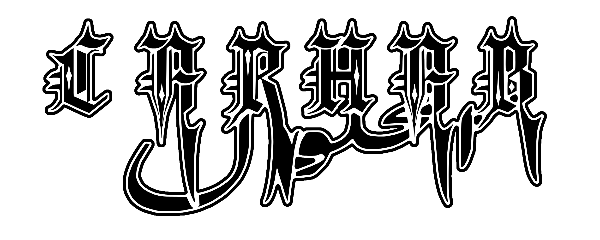

<strong>Carhab Solutions: Sign-Based Autonomous Navigation</strong>

Carhab Solutions presents an innovative approach to autonomous vehicle navigation that relies exclusively on traffic sign recognition and depth sensing. Unlike traditional autonomous vehicles that depend on lane following algorithms, our system implements a point-to-point navigation strategy that's more adaptable to diverse environments.

The vehicle approaches the closest identified sign and executes its associated instruction, then locates the next sign in sequence. This modular solution provides greater flexibility for small-scale autonomous vehicles across various settings, from indoor delivery systems to inventory management.

 

Team Members: Mohammad Alburaidi (malburaidi@ucdavis.edu), Logan Field (lrfield@ucdavis.edu), Nasih Al-Barwani (nmalbarwani@ucdavis.edu), Pranav Nallapaneni

 

<strong>Features</strong>

<strong>Sign-Based Navigation System</strong> 

Our vehicle recognizes six types of traffic signs (left, right, forward, stop, caution, and u-turn) and executes corresponding maneuvers. The system treats signs as either destination indicators (left, right, u-turn) or behavior modifiers (caution, forward, stop) that affect the vehicle's approach behavior.

<strong>Real-time Depth Sensing</strong> 
Using an Intel RealSense camera, the vehicle accurately perceives distances to signs and obstacles, enabling precise positioning and collision avoidance during navigation.

<strong>Finite State Machine Implementation</strong> 
The driving algorithm is structured as a finite state machine that processes tracking input, state timing, and depth information to determine the optimal navigation path, allowing for complex behaviors like waiting at stop signs or slowing for caution signs.

<strong>Adaptive Speed Control</strong> 
The vehicle dynamically adjusts throttle based on the distance to target signs, slowing as it approaches them to ensure accurate execution of turning instructions and reduce collision risk.

 

<strong>Technology Stack</strong>

- <strong>Vehicle Base:</strong> Modified Traxxas RC vehicle with improved bumper and bypass suspension 
- <strong>Vision System:</strong> Intel RealSense camera for RGB imaging and depth sensing 
- <strong>Object Detection:</strong> YOLOv5s model customized for traffic sign detection 
- <strong>Control Interface:</strong> FT232H Adafruit breakout board for motor control signals 
- <strong>Processing Platform:</strong> Laptop-based computing (with documented steps for Jetson TX2 implementation)

 

<strong>Getting Started</strong>

<strong>Hardware Requirements</strong>
 
- Traxxas RC vehicle 
- Intel RealSense camera (D435 or similar) 
- FT232H Adafruit breakout board 
- PCA9685 Adafruit PWM module 
- Laptop with USB 3.0 port

<strong>Software Installation</strong>

1. Clone the repository

<pre>
git clone https://github.com/yourusername/carhab-solutions.git
cd carhab-solutions
</pre>

2. Install dependencies

<pre>
pip install -r requirements.txt
</pre>

3. Install PyTorch and YOLOv5

<pre>
pip install torch torchvision
pip install ultralytics
</pre>

4. Install Intel RealSense SDK

<pre>
pip install pyrealsense2
</pre>
 

<strong>Sign System</strong>

Our solution uses a dual-category sign system:

<strong>Destination Signs</strong> 
- <strong>Left Arrow:</strong> Vehicle turns left at sign 
- <strong>Right Arrow:</strong> Vehicle turns right at sign 
- <strong>U-Turn:</strong> Vehicle performs a 180° turn

<strong>Modifier Signs</strong> 
- <strong>Forward:</strong> Increases approach speed 
- <strong>Caution:</strong> Decreases approach speed 
- <strong>Stop:</strong> Pauses briefly before continuing

 

<strong>Project Development</strong>

<strong>Model Training</strong> 
The YOLOv5s model was trained on a custom dataset of printed traffic signs, photographed from multiple angles and distances. Transfer learning was applied after initial training on the German Traffic Sign Recognition Benchmark (GTSRB) dataset.

The custom dataset includes: 
- 739 original images (70-30 train-test split) 
- 1773 total images after augmentation 
- Significantly improved detection distance from ~1.2m to ~4.4m

<strong>Driving Algorithm</strong> 
The driving algorithm functions as a state machine with the following primary states: 
1. <strong>IDLE:</strong> Waiting for sign detection 
2. <strong>ALIGN:</strong> Centering on detected sign 
3. <strong>APPROACH:</strong> Moving toward the sign 
4. <strong>EXECUTE:</strong> Performing the sign's instruction 
5. <strong>POLLING:</strong> Searching for the next sign 
6. <strong>OBSTACLE:</strong> Reversing when obstacles are detected

 

<strong>Future Work</strong>

- Integration with Jetson platforms for edge computing capabilities 
- Expansion of sign library to include more complex instructions 
- Implementation of environmental mapping for improved navigation 
- Development of multi-sign sequence interpretation for complex routing

 

<strong>Acknowledgements</strong>

We extend our gratitude to Professor Chuah and Kartik for their help and guidance throughout the quarter.

 

<strong>References</strong>

- <a href="https://github.com/NVIDIA-AI-IOT/jetracer">NVIDIA-AI-IOT/jetracer</a> 
- <a href="https://github.com/noshluk2/ROS2-Autonomous-Driving-and-Navigation-SLAM-with-TurtleBot3">ROS2 Autonomous Driving and Navigation SLAM</a> 
- <a href="https://github.com/Just-Jacksone/ARMS/tree/main">A.R.M.S. Project</a> 
- <a href="https://github.com/ultralytics/yolov5">YOLOv5 Object Detection</a> 
- <a href="https://medium.com/@jithin8mathew/estimating-depth-for-yolov5-object-detection-bounding-boxes-using-intel-realsense-depth-camera-a0be955e579a">Intel RealSense Depth Estimation</a>

